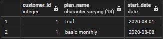
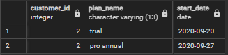
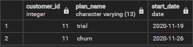
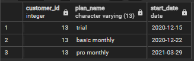
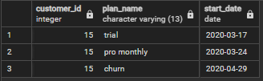
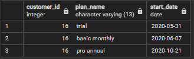
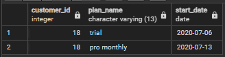
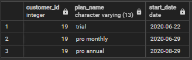
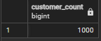

### A. Customer Journey

**Based off the 8 sample customers provided in the sample from the subscriptions table, write a brief description about each customer’s onboarding journey.**

Customer 1:
This customer started off with a trial on August 1, 2020. Then moved on to the basic monthly plan after their trial ended on August 8, 2020.




Customer 2:
This customer started off with a trial on September 20, 2020. Then moved on to the pro annual plan after their trial ended on September 27, 2020.



Customer 11:
This customer started off with a trial on November 19, 2020. Then they canceled their plan after the trial on November 26, 2020.



Customer 13:
This customer started off with a trial on December 15, 2020. Then moved on to the basic monthly plan after their trial ended on December 22, 2020. And on March 29, 2021 they upgraded to the pro monthly plan.



Customer 15:
This customer started off with a trial on March 17, 2020. Upgraded to the pro monthly plan on March 24, 2020. But on April 29, 2020 they cancelled their subscription.



Customer 16:
This customer started off with a trial on May 31, 2020. Then moved on to the basic monthly plan after their trial ended on June 7, 2020. And on October 21, 2021 they upgraded to the pro annual plan.



Customer 18:
This customer started off with a trial on July 6, 2020. Then moved on to the pro monthly plan after their trial ended on July 13, 2020.



Customer 19:
This customer started off with a trial on June 22, 2020. Then moved on to the pro monthly plan after their trial ended on June 29, 2020. And on August 29, 2020 they upgraded to the pro annual plan.



---

### B. Data Analysis Questions

**1. How many customers has Foodie-Fi ever had?**

```sql
SELECT 
	COUNT(DISTINCT(customer_id)) AS customer_count
FROM 
	foodie_fi.subscriptions
```


| customer_count|
| ------------- |
| 1000          |

**2. What is the monthly distribution of trial plan start_date values for our dataset - use the start of the month as the group by value**

```sql
SELECT 
	DATE_PART('MONTH', sub.start_date) AS month_date,
	TO_CHAR(sub.start_date, 'Month') AS month,
	COUNT(sub.customer_id)
FROM
	foodie_fi.plans p
JOIN foodie_fi.subscriptions sub ON p.plan_id = sub.plan_id
WHERE sub.plan_id = '0'
GROUP BY month_date, month
ORDER BY month_date ASC
```

| month_date | month     | count |
|------------|-----------|-------|
| 1          | January   | 88    |
| 2          | February  | 68    |
| 3          | March     | 94    |
| 4          | April     | 81    |
| 5          | May       | 88    |
| 6          | June      | 79    |
| 7          | July      | 89    |
| 8          | August    | 88    |
| 9          | September | 87    |
| 10         | October   | 79    |
| 11         | November  | 75    |
| 12         | December  | 84    |

**3. What plan start_date values occur after the year 2020 for our dataset? Show the breakdown by count of events for each plan_name**

```sql
SELECT
	p.plan_id,
	p.plan_name,
	COUNT(sub.customer_id)
FROM
	foodie_fi.plans p
JOIN foodie_fi.subscriptions sub ON p.plan_id = sub.plan_id
WHERE sub.start_date >= '2021-01-01'
GROUP BY p.plan_id, p.plan_name
ORDER BY p.plan_id ASC
```
| plan_name		 | count |
| ---------------|------ |
| "basic monthly"| 8     |
| "pro monthly"	 | 60    |
| "pro annual"	 | 63    |
| "churn"		 | 71    |

**4. What is the customer count and percentage of customers who have churned rounded to 1 decimal place?**

```sql
SELECT
	SUM(CASE WHEN plans.plan_name = 'churn' THEN 1 END) AS churn_count,
	CAST(SUM(CASE WHEN plans.plan_name = 'churn' THEN 1 END) AS FLOAT) 
		/ COUNT(DISTINCT sub.customer_id) * 100 AS churn_pct
FROM
	foodie_fi.plans 
JOIN foodie_fi.subscriptions sub ON plans.plan_id = sub.plan_id
```

**5. How many customers have churned straight after their initial free trial - what percentage is this rounded to the nearest whole number?**

```sql
WITH customer_next_plan AS (
	SELECT
		customer_id,
		plan_id,
		LEAD(plan_id) OVER (
			PARTITION BY customer_id 
			ORDER BY start_date
		) AS next_plan
	FROM foodie_fi.subscriptions
)

SELECT
	COUNT(*) AS customers_churned,
	ROUND(100.0 * COUNT(*) / (SELECT COUNT(DISTINCT customer_id) FROM customer_next_plan), 1) AS churn_percentage
FROM
	customer_next_plan 
WHERE next_plan = 4
	AND plan_id = 0

```

**6. What is the number and percentage of customer plans after their initial free trial?**

```sql
WITH customer_next_plan AS (
	SELECT
		customer_id,
		plan_id,
		LEAD(plan_id) OVER (
			PARTITION BY customer_id 
			ORDER BY start_date
		) AS next_plan
	FROM foodie_fi.subscriptions
)

SELECT
	next_plan,
	COUNT(DISTINCT customer_id) customer_plan,
	ROUND(100.0 * COUNT(*) / (SELECT COUNT(DISTINCT customer_id) FROM customer_next_plan), 1) AS churn_percentage
FROM customer_next_plan
WHERE plan_id = 0
GROUP BY next_plan
```

**7. What is the customer count and percentage breakdown of all 5 plan_name values at 2020-12-31?**

```sql
WITH customer_next_plan AS (
	SELECT
		customer_id,
		plan_id,
		start_date,
		LEAD(plan_id) OVER (
			PARTITION BY customer_id 
			ORDER BY start_date
		) AS next_plan
	FROM foodie_fi.subscriptions
	WHERE start_date <= '2020-12-31'
)

SELECT
	plan_id,
	COUNT(DISTINCT customer_id) customers,
	ROUND(100.0 * COUNT(*) / (SELECT COUNT(DISTINCT customer_id) FROM customer_next_plan), 1) AS churn_percentage
FROM customer_next_plan
WHERE next_plan IS NULL
GROUP BY plan_id
```

**8. How many customers have upgraded to an annual plan in 2020?**

```sql
SELECT
	COUNT(DISTINCT customer_id) AS customer_count
FROM foodie_fi.subscriptions sub
JOIN foodie_fi.plans ON plans.plan_id = sub.plan_id
WHERE start_date <= '2020-12-31'
	AND sub.plan_id = 3
	```

**9. How many days on average does it take for a customer to an annual plan from the day they join Foodie-Fi?**

```sql
WITH trial_plan AS (
	SELECT 
		customer_id,
		start_date as trial_start
	FROM foodie_fi.subscriptions
	WHERE plan_id = 0
),
	annual_plan AS(
	SELECT 
		customer_id,
		start_date as annual_start
	FROM foodie_fi.subscriptions
	WHERE plan_id = 3
)

SELECT 
	ROUND(AVG(a.annual_start - t.trial_start), 1) AS avg_days_to_annual_upgrade
FROM trial_plan t
JOIN annual_plan a ON a.customer_id = t.customer_id
```

**10. Can you further breakdown this average value into 30 day periods (i.e. 0-30 days, 31-60 days etc)**

```sql
WITH trial_plan AS (
	SELECT 
		customer_id,
		start_date as trial_start
	FROM foodie_fi.subscriptions
	WHERE plan_id = 0
),
	annual_plan AS (
	SELECT 
		customer_id,
		start_date as annual_start
	FROM foodie_fi.subscriptions
	WHERE plan_id = 3
),
	bins AS (
	SELECT
		WIDTH_BUCKET(a.annual_start - t.trial_start, 0, 365, 13) AS avg_days_to_annual_upgrade
	FROM trial_plan t
	JOIN annual_plan a ON a.customer_id = t.customer_id
)
	
SELECT 
  ((avg_days_to_annual_upgrade - 1) * 30 || ' - ' || avg_days_to_annual_upgrade * 30 || ' days') AS bucket, 
  COUNT(*) AS num_of_customers
FROM bins
GROUP BY avg_days_to_annual_upgrade
ORDER BY avg_days_to_annual_upgrade
```

**11. How many customers downgraded from a pro monthly to a basic monthly plan in 2020?**

```sql
WITH customer_next_plan AS (
	SELECT
		customer_id,
		plan_id,
		LEAD(plan_id) OVER (
			PARTITION BY customer_id 
			ORDER BY start_date
		) AS next_plan
	FROM foodie_fi.subscriptions
	WHERE DATE_PART('year', start_date) = 2020
)

SELECT 
	COUNT(*)
FROM customer_next_plan
WHERE plan_id = 2
	AND next_plan = 1
```